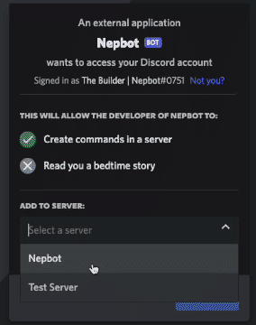
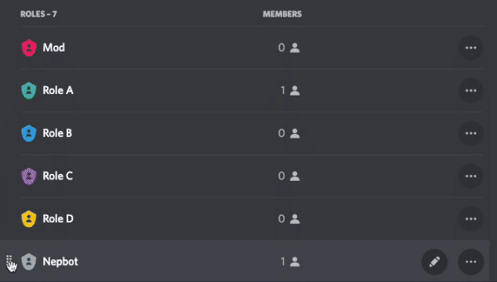

# Add Nepbot to Discord

**0. Make sure you own a server first.**

> Don’t have a server yet? [Click here to see how to create a server.](https://support.discord.com/hc/en-us/articles/204849977-How-do-I-create-a-server-)
> 

1. Sign in to discord.
2. [Click here](https://discord.com/oauth2/authorize?client_id=958997413803196476&permissions=8&scope=bot%20applications.commands) to add Nepbot to your Discord server.
3. Select a server.
4. Add Nepbot as an Administrator.
    
    
5. After authorization, go back to your discord server, and you’ll find NepBot there. :)

    Nepbot will automatically created two channels :     
    > \#nepbot-join : public channe  
    > \#nepbot-settings : private channel for admins
    
    You can always change the name of these two channels.
6. Upon added to the server, NepBot will create a role for itself in the Discord “server settings”. 
**Make sure “Nepbot” is placed above any roles it will moderate in the role hierarchy.** 
    You can put place Nepbot below the admin roles to make sure Nepbot can never overrule Admins.
    
    To change role hierarchy, please go to “server settings” — ”roles” — hold and drag on the left of each role to manage role hierarchy.
    
    