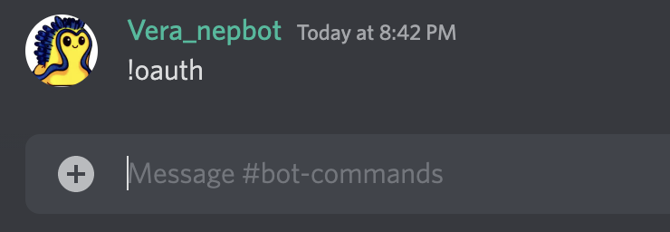

# Connect to Near wallet

1. In a server with Nepbot, enter !oauth in a channel.

1. Then you will receive a DM from the bot with a link to connect to your Near wallet.

 * Make sure it's the official Nepbot you're interacting with.

1. Go to the link page and click on the connect button. 

1. Choose the Near wallet you want to connect and click on “Next” then “Connect”.
2. Wait for a while. When you see “success” on the page, go back to your discord server, and you get the corresponding roles gated by tokens. 
3. If you don’t have enough tokens at the time of verification, don’t worry. Nepbot regularly checks the balance and status in all verified accounts in the server, making sure that all token-based roles are constantly updated. If you meet the requirement later, for example, when you receive enough tokens in your wallet or become a validator, Nepbot will assign you with the corresponding role within minutes.