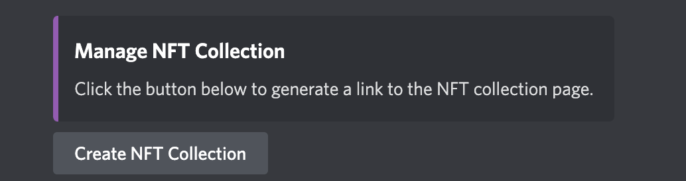
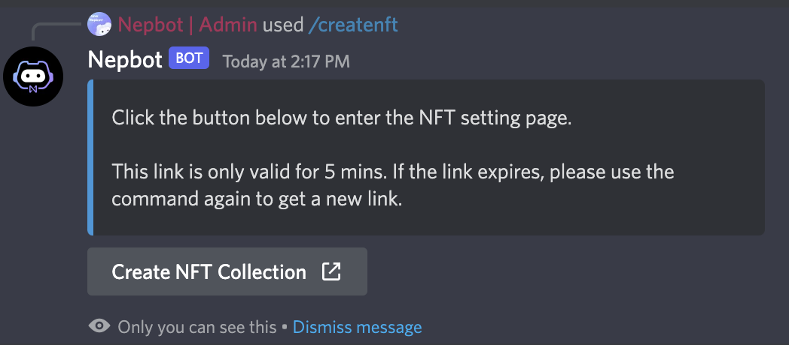
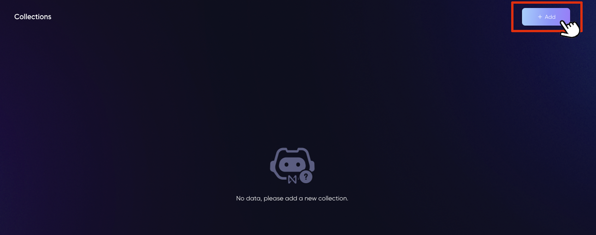
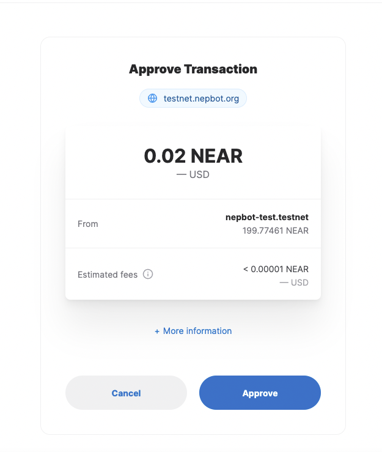
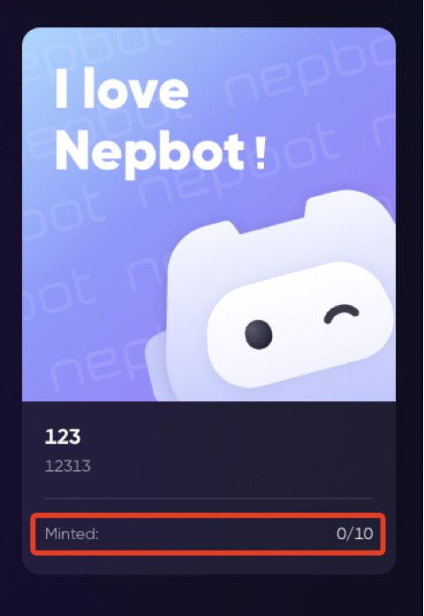

# Create NFT collections

**⚠️  This command is only accessible to server owners.**

**⚠️  The NFT collection created can only be minted by server members (with specified roles), and after minted, the NFT will be displayed in both NEAR wallet and Paras, and can be listed on marketplace as other paras NFTs.**

**⚠️  Nepbot currently uses Paras NFT contract to mint the NFT.** 

1. To enter the NFT collection page, you can 
    1. Go to the channel #nepbot-settings and find the button “Create NFT collection”, or
        
        
        
    2. use the command `/createnft`
        
        
        
        > This link is only valid for 5 mins, and can only be used once. If the link expires, please click on the button or use the command again to get a new link.
2. Click on “Add” to create a new NFT collection for this server.
    
3. Fill in the basic information for this collection.
    1. Logo: Upload a logo for your collection. It will also be the logo for your collection on Paras. 
    Accepted format: JPG/JPEG/PNG/GIF/SVG. Max size:1MB.
    2. Cover: Upload a cover for your collection. This will be displayed on Paras as well.
    Accepted format: JPG/JPEG/PNG/GIF/SVG. Max size:1MB.
    3. Name: Customize the name of this collection.
    4. Description: Add a description to this collection.
    5. Mint Price(optional): Set a price per item for the NFTs in this collection. The collection will be free to mint if you leave this field blank.
    6. Royalty(optional): Determine the royalties for this NFT collection. You can add the Near account ID and percentage here. The wallets added will get the specified percentage of the sold Price every time the NFT gets sold. If you leave this field blank, the royalty will be 0%.
    7. Required Role(optional): Items in this collection can only be minted by members with at lease one of the selected roles. 
    This collection is open to all the server members if no roles are selected.
    8. Minting Limit Per Wallet(optional): Set the maximum amount of NFTs that one wallet can mint from this collection. For example, if set as 2, only up to 2 NFTs can be minted from this collection.
    There will be no upper limit if you leave this field blank.
4. Click on “OK”, confirm this creation, and approve this transaction.
    
5. After the collection is created, hit the collection to enter the collection page. Click on “Add” again to create NFT item in this collection.
6. Upload the image and fill out the fields for this NFT, including: 
    1. Image: Upload the image file that you want to make into an NFT.
    JPG/JPEG/PNG/GIF/SVG. Max size:1MB.
    2. Name: Name this NFT item.
    3. Description: Add a detailed description to your NFT.
    4. Number of copies: Set the number of items that can be minted.
    5. Attribute (Optional): Define the type and value for this NFT. For example, type: color; value: blue.
    You can add multiple attributes to the NFT by clicking “+add” below.
7. Click on “OK” and approve the transaction. 
8. After it’s created, you can always check the copies minted on the collection page here.
    
    
9. You can also click on the NFT item to check this item and its properties on Paras.