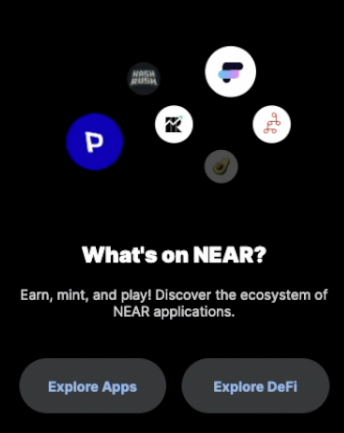
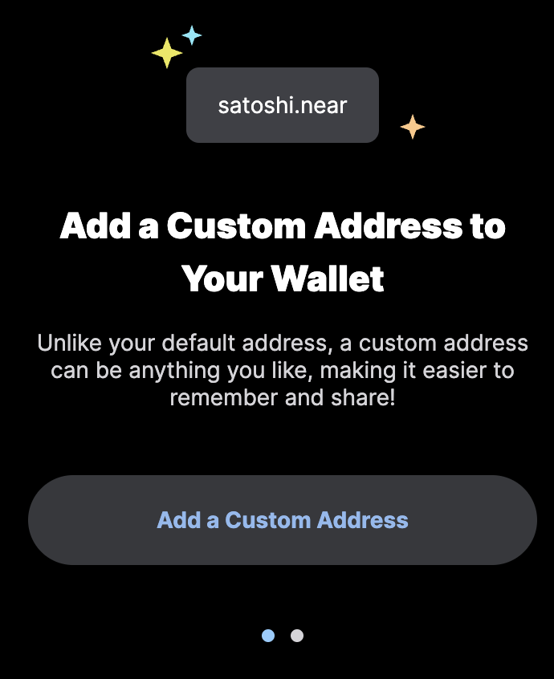
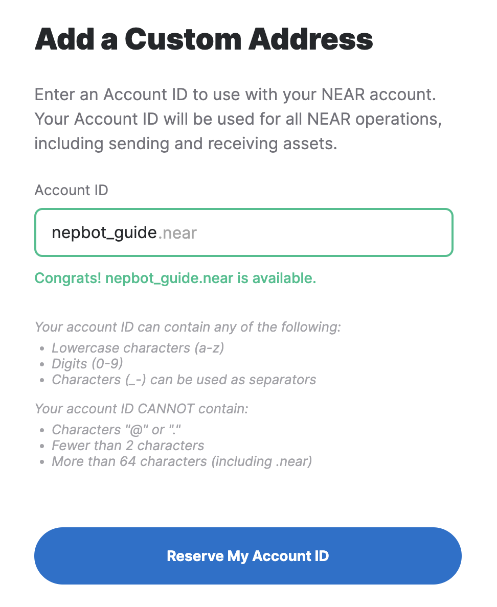
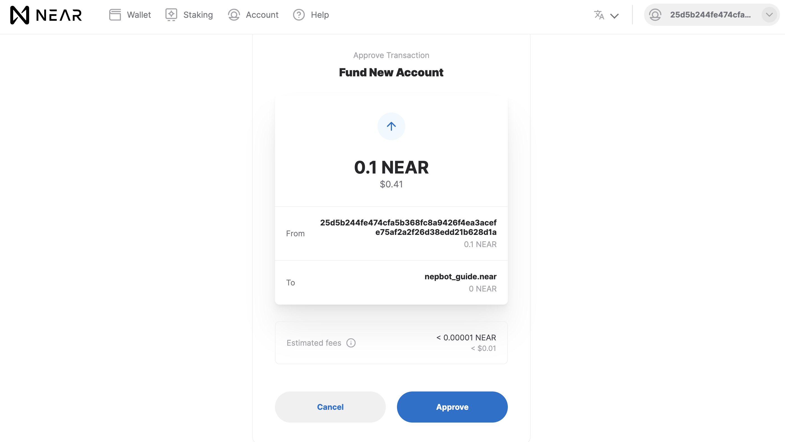
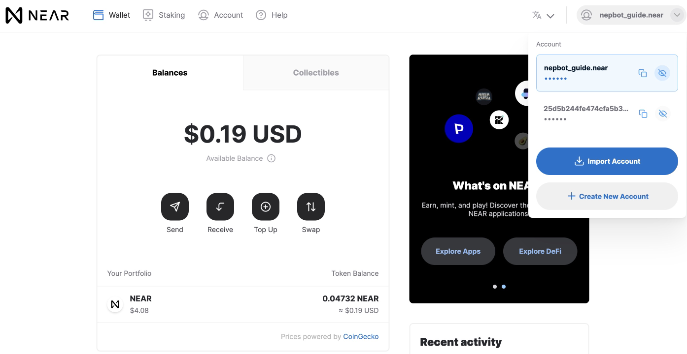

# How to create a NEAR wallet

## Step 1  Go to Near wallet

Go to [wallet.near.org](https://wallet.near.org/), and click on Create Account, and Get Started.

## Step 2 Choose a security method

Choose which security method you’d like to use.

There’re three types of security method

1. Secure Passphrase, that is, seed phrase, what is commonly called by crypto users.
2. Using a ledger hardware wallet. You can also enable ledger hard wallet later after the wallet is created.
3. Email registry. It’s easy but are not recommended as this method is not as secure as the above ones.

Hence here we recommend to choose “Secure Passphrase” to secure the account.

## Step 3 Keep your Secure Passphrase somewhere safe!

12 words will generated as your secret passphrase for this options. Write down your secure passphrase and keep them somewhere safe.

**Important:** 

1. Anyone with the access to your wallet will also have the full access to your NEAR wallet.
2. The 12 words Secure Passphrase MUST be secured. If you lose your secret passphrase, you will not be able to recover your account!
3. The words must be written in the correct order, so make sure to note them in correct order.

Congratulations! You’ve had your NEAR wallet created! You can now click the links beside to explore the NEAR ecosystem.

However, as of this step, your wallet is still just a 64-bit wallet address. 

The following steps are optional:

## Step 4 Activate your account

Your account is almost set up, but you need to fund it with at least 0.1 NEAR to activate it. Note that if you want to interact with the NEAR ecosystem by using your wallet or creating a custom address, we advise you to send at least 1 NEAR there.

You will be able to do so after account creation.

If you don’t have NEAR on any other wallet, you can fund your account by buying NEAR on [Moonpay](https://www.moonpay.com/)/[Utorg](https://utorg.pro/) or transferring it from any supported exchange. Also, you can bridge tokens from MetaMask, using a [Rainbow Bridge](https://near.org/bridge/):

1. Click “Top Up” in your wallet.
2. Choose any preferable option and follow the instructions of our partner.

If you already have NEAR on another wallet, follow these simple steps:

1. Click “Deposit Near” in your NEAR wallet.
2. Copy your Account ID or get a code via scanning the QR code.
3. Go to a Sending wallet from which you want to transfer NEAR.
4. Click “Send” and enter the number of coins you want to transfer.
5. Paste a NEAR address or QR code.
6. Wait for a confirmation message stating that the transaction is completed.

As soon as you receive the funds, your account activates automatically.

## Step 5 Add a custom address to your wallet

Once your acccount is activated, you can choose to add a custom address to your wallet, making it easy to read, remember and share.
1. Click here to add it.

2. Name your account and then click "Reserve My Account ID".

3. Go through Step 2 and Step 3 again, and fund your account with 0.1 NEAR to reserve your customized address. 

4. Approve the transaction and you'll see your customized account ID there! :)
