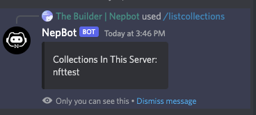

# Get Collections for the Server

1. You can always use the command `/listcollections` to find out all the collections created in this server.

    

2. Find the collection you want to mint from, copy the name and use the command `/mint collection [name]` to mint from it.
    
    Tips: To use this command, you can directly type `/mint` and then press “Enter”, and then enter the collection name. 
    
    