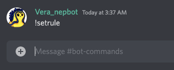

# Set rules for roles

**0. Only the server owner can use this command in the server.**

**0. Invite Nep bot to your Discord.**

**0. Don’t have a role? Create roles first.**

1. Enter !setrule in the chat.

1. You will receive a DM from Nepbot with a link to set token permissions for roles.

1. Go to the link, which will take you to the “Set rule” page.
2. Click on “Add” button on the this page, and a window will pop up.

1. Choose a role to add a rule to it. There’re four types of rules for now.
    
    Rule types:
    
    1. **Token amount: gated by NEP-141 tokens.**
        
        You need to fill in the token address and token amount as the threshold. The user can be assigned with the role by holding at least a certain amount of the selected token.
        
        
        
        <aside>
        💡 [How to get my token address?](./doc/How_to_get_my_token_address.md)
        </aside>
        
    2. **OCT roles: gated by the staking states(delegator/validator) on Octopus Appchains.**
        
        Choose an appchain and its staking status on that appchain. For example, in the screenshot below, it means that the role is open for delegators on Fusotao appchain.
        
        
        
    3. **Near balance: gated by Near balance.**
        
        Enter the amount of $Near required for this role. 
        
        
        
    4. **NFT: gated by an NEP-171 NFT (including those on Paras or from other NFT contracts)**
        
        You’ll need to enter the NFT contract ID and the minimum number of NFT required. NFT contract ID can be found in the details of an NFT. Take Mintbase as an example, you can find the contract ID here. 
        
        
        
        
        
        If the NFT are created on Paras with a contract ID of x.paras.near, you will also need to provide the collection URL here to distinct the collections. 
        
        
        
2. Click on “ok” to save the rule, approve the transaction and after a while, it will be added to the list and start to take effect.
    
    > *This will start a transaction because the rule is saved on chain, and therefore requires a transaction with the smart contract.*
    > 
    
    
    
    It will ask for a 0.02 Near as the estimated maximum amount of gas, but the transaction may cost less than 0.02Near. The rest of the pre-charged fees will be returned to your wallet.
    
    
    
3. Once the rules are set, Nepbot will constantly monitors the verified accounts’ balance and status and manage roles accordingly.
    
    You can also delete a rule by hitting the “delete” button under each rule.
    
    Make sure that you’re using
    
    
    

> [!NOTE]
> One or more tokens can be configured for each role. When more than one rule is configured, a member can get the role if he/she meets the requirement for either one of the configurations.