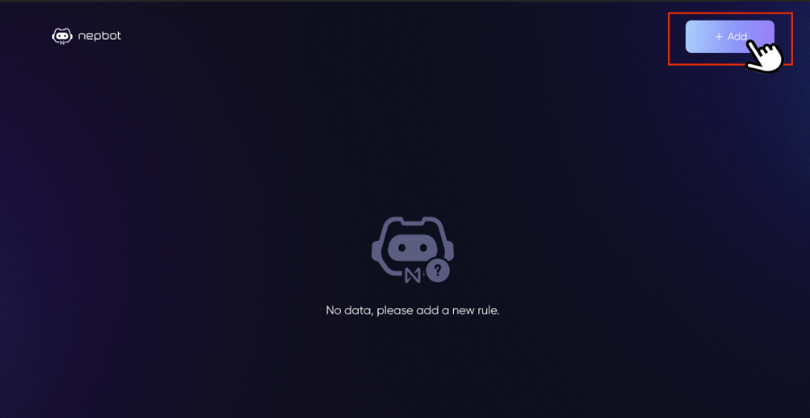
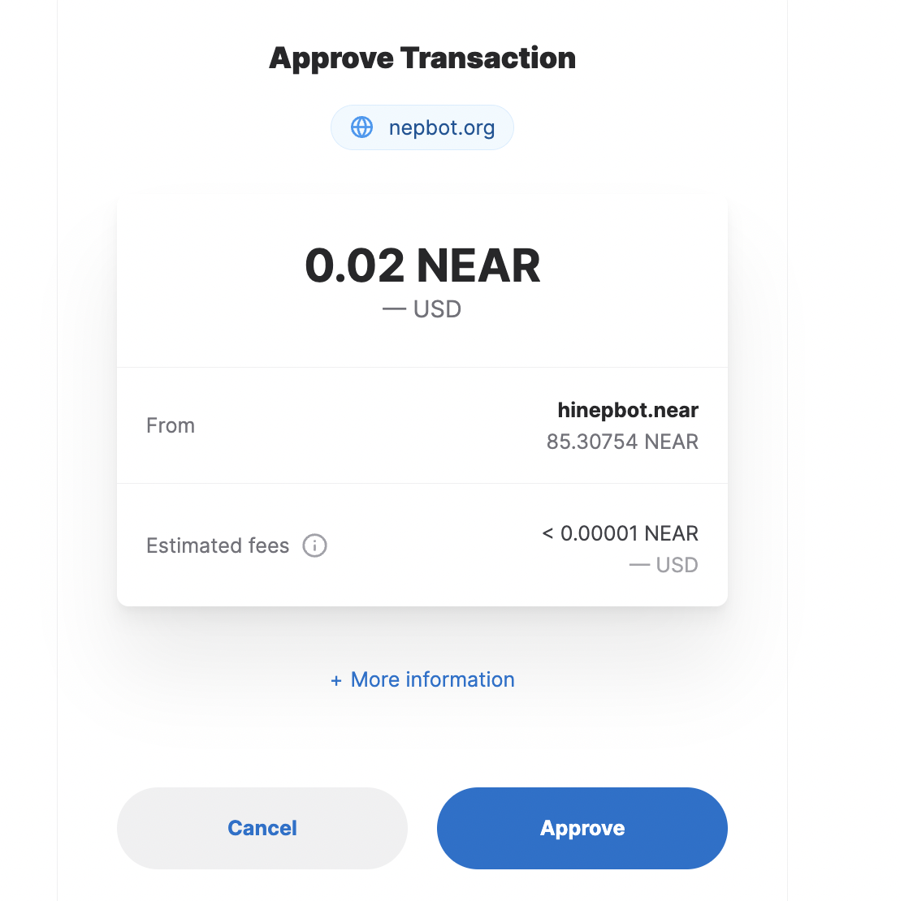
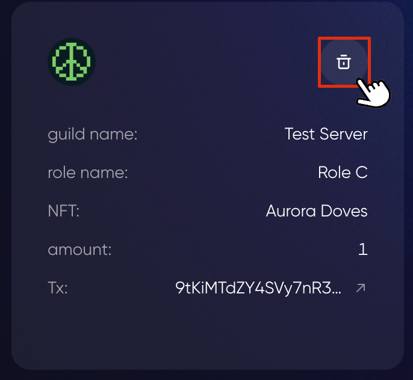

# Set Rules for Roles

**⚠️ Make sure the Nepbot is placed above other roles it manages in role hierarchy.**

**⚠️  This command is only accessible to server owners.**

1. To set token-gated rules for roles, you can 
    1. Use the “Set Rule” button in #nepbot-settings
        
    2. Enter `/setrule` in the chatbox
        
        
2. You will receive a private response from Nepbot directly in the server. This message is only visible to you. Click the link to enter the Setrule page.
    
    > This link is only valid for 5 mins, and can only be used once. If the link expires, please click on the button or use the command again to get a new link.
3. Click on “Add” and choose a role to add rule for.

    
4. Currently there’re five types of rules
    - **Token Amount**：
        - NEP-141 token holdings
        - Info Required:
            - Token Address: you can find it here on Near Explorer
                
            - Token Amount: the minimum amount of token holding required to get this role
    - **OCT Roles**:
        - Staking states on Octopus Appchains
        - Info Required:
            - Appchain ID: select an Appchain from the list
            - Oct Role: whether a validator or delegator can get this role
    - **NEAR Balance**:
        - Amount of NEAR in wallet
        - Info Required:
            - Balance: the minimum amount of NEAR balance required to get this role
    - **NFT**: 
        - NFT(NEP-171) holdings (including those on Paras or from any contract)
        - Info Required:
            - NFT Contract ID：Fill in the contract address of this NFT collection
            -   *Collection URL:* If it's an Paras NFT collection, that is, if the contract address is `x.paras.near`, you will also see this field and need to copy and paste the link to the collection on Paras here.
            - Amount: this determined how many pieces of NFTs from the collection one need to hold to get this role
    - **AstroDAO Roles**:
        - DAO memberships on AstroDAo
        - Info Required:
            - DAO Contract ID: You can find the DAO contract ID on AstroDAO under the DAO name.
            - AstroDAO roles: whether everyone in this DAO or member in a certain group can get this role
    
5. Click OK and approve the transaction to save the rule. It will take you back to the setrule page once succeeds, and the rules will be displayed there.
    
        
    > *Here when adding a rule, it will start a transaction asking for a very little bit of gas fee because rules are saved on chain, and therefore requires a transaction with the smart contract.*

    
    > *It will ask for a 0.02 Near as the estimated maximum amount of gas, but the transaction should always cost less than 0.02 Near. The rest of the pre-charged fees will be returned to your wallet.*

    

    > Since the rules are saved on chain, you can find the transaction hash here. It links to this transaction details on [Nearblocks.io](https://nearblocks.io/). 

    
\6. Once the rules are set, Nepbot will constantly monitor the verified accounts’ balance and status and update roles accordingly.
For example, if one transfers or sells the NFT, he/she will also be removed from the corresponding roles.
    
    You can also delete a rule by hitting the “delete” button on each rule.
    
    
    
    **Note:**
    
    One or more tokens can be configured for each role. When more than one rule is configured, a member can get the role if he/she meets the requirement for either one of the configurations.