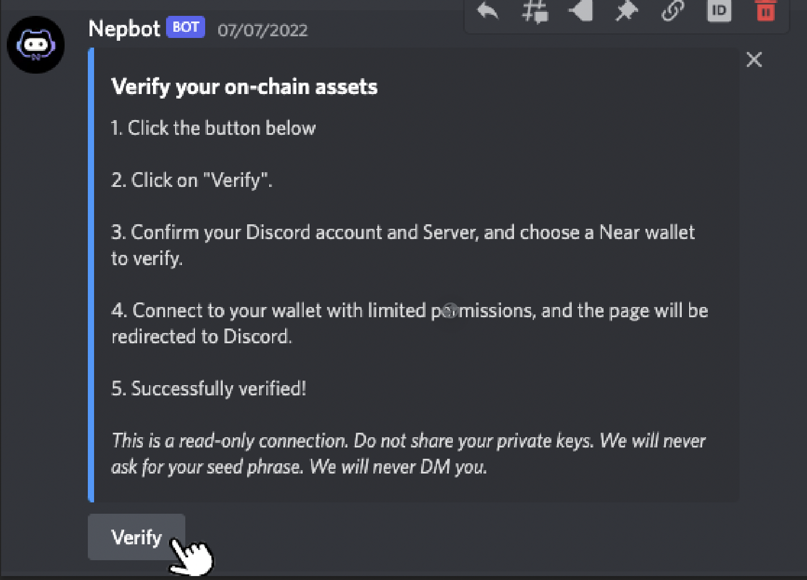
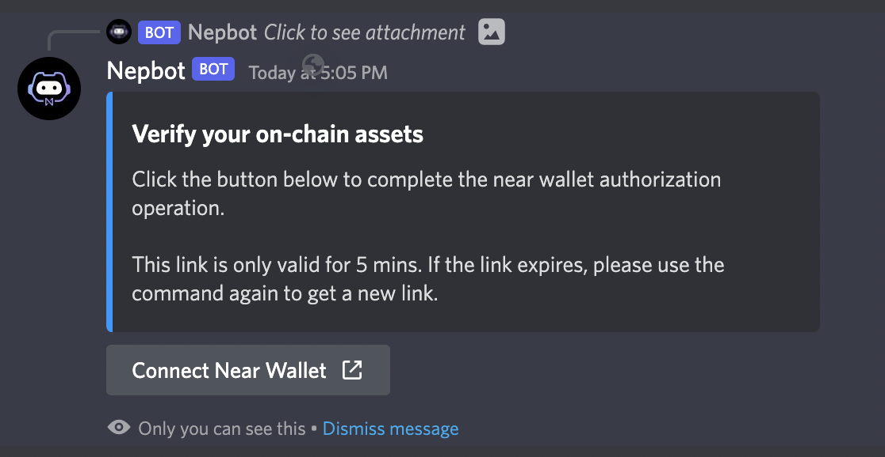
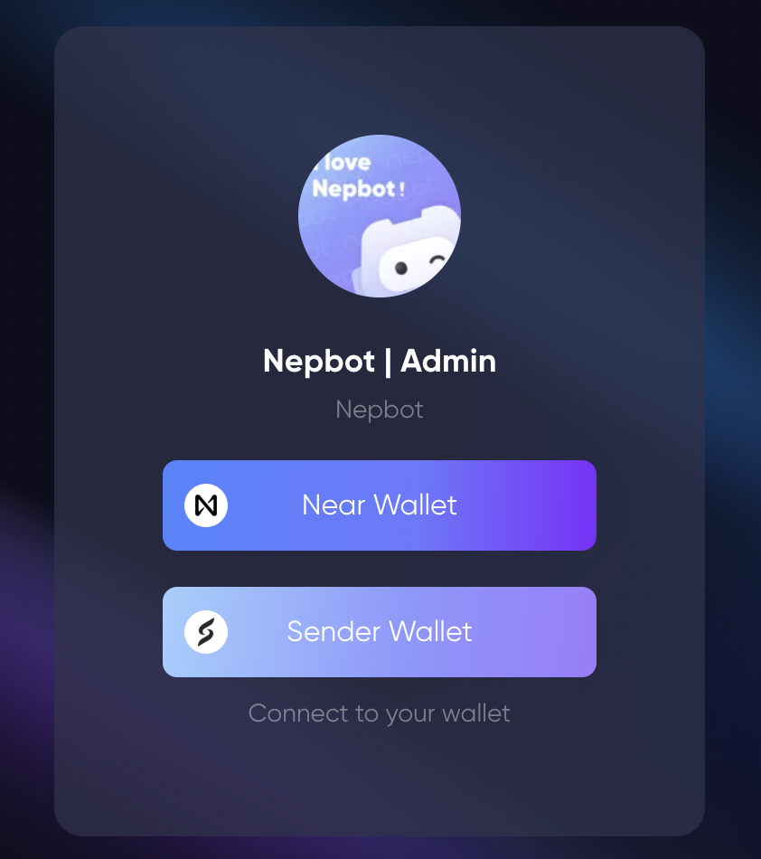
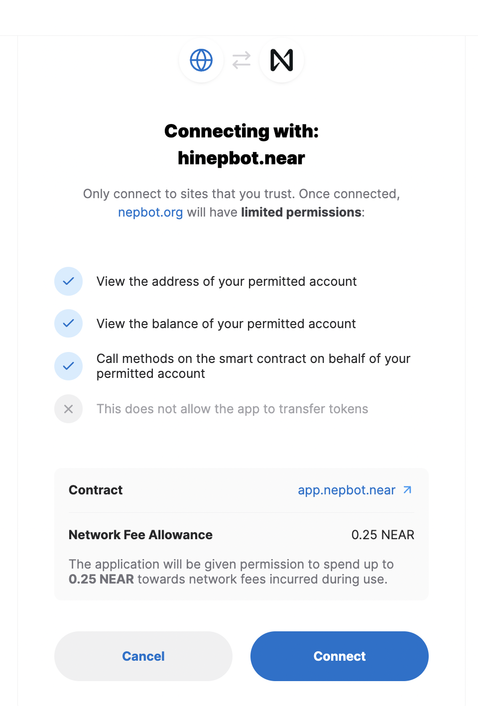
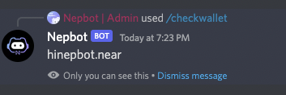
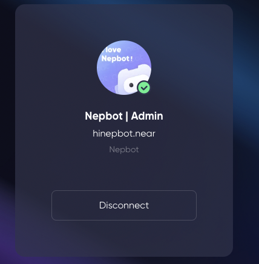

# Verify your Assets
Connect to your NEAR wallet and get verified.

1. In a server with Nepbot, enter /verify or find the “verify” button  

2. Nepbot will respond with a private message directly in the server that can only be seen by yourself.
    > This link is only valid for 5 mins, and can only be used once. If the link expires, please click on “verify” or use the command “/verify“ to get a new link.
    Click the button to connect to your wallet.

3. Choose a wallet to link with. Nepbot currently support both NEAR wallet and Sender Wallet.

4. Nepbot will only ask for a limited access to view you account and call method on the smart contract. It will not start any transaction or transfer tokens without your permission.

5. After successfully linked to your wallet, the page will be redirected to Discord.
6. You can always use `/checkwallet` or `/verify` to check your verification status and connected wallet.

