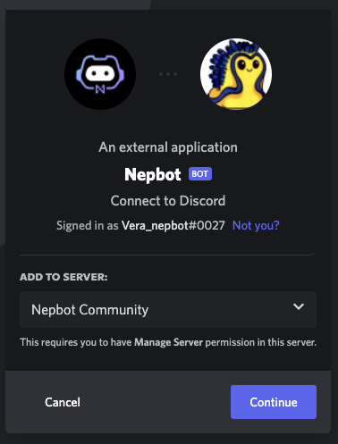

**0. Make sure you own a server first.**

> [!NOTE]
> Don’t have a server yet? [Click here to create a server.](https://support.discord.com/hc/en-us/articles/204849977-How-do-I-create-a-server-)

1. Sign in to discord.
2. [Click here](https://discord.com/oauth2/authorize?client_id=958997413803196476&permissions=8&scope=bot) to add Nepbot to your Discord server.
3. Select a server.

1. Add NepBot as an Administrator.

1. After authorization, go back to your discord server, and you’ll find NepBot there. :)
2. Upon joining the server, NepBot will create a role for itself in the Discord “server settings”. **Make sure “Nepbot” is at the top of the server role hierarchy. It needs to be above any roles it will moderate.** 
    
    
    
    In “server settings” go to ”roles”, then hold and drag on the left of each role to manage role hierarchy.
    
> [!NOTE]
> Rules are recorded in the smart contract, so it may take a little bit of time and gas fee to add or remove a rule, please be patient.